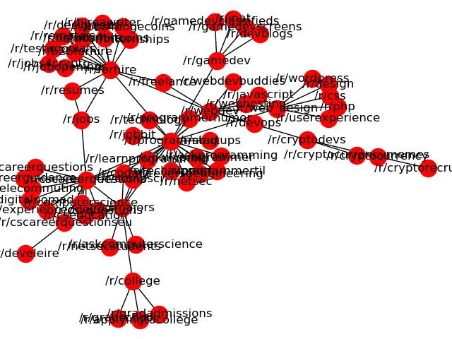

:date: 2018-11-02
:modified: 2019-02-07
:title: Analyzing Subreddit Networks
:category: Projects
:slug: subreddit-networks

Introduction
------------

The popular website reddit.com contains numerous messageboards
(called "subreddits"), each dedicated to a particular subject,
such as a hobby or topic of interest. Often the users of these
subreddits will place links to related subreddits on the sidebar
of the webpage. In this way, these linked subreddits form a
network of closely related online communities. Because these
lists of links are human-curated, they give high-quality
indicators of related topics and communities. By following these
links programmatically, we can collect the data needed to to
visualize and analyze these networks.

The code for this project can be found on Github_.

.. _Github: https://github.com/mmallicoat/subreddit-graphs

Scrape the Data
---------------

I wrote simple web scraper using the Python library ``scrapy``
which collects the list of links and other information from each
subreddit page. Starting from an initial subreddit, the scraper
searches the sidebar on the page for any related subreddits that
have been linked there. The scraper then follows those links and
iteratively searches for more links. The name of each subreddit is
collected, along with its description, number of subscribers, and
the list of links to other subreddits.

From these data, it is possible to construct the network of
subreddits surrounding the initial page. In this network (often
called a *graph* in mathematics), each node is a subreddit and
each edge is a hyperlink between them. For simplicity, I decided
to build a non-directed graph, ignoring the directionality of
hyperlinks: a hyperlink from subreddit A to B is treated in the
same manner as a hyperlink from subreddit B to A.

The scraper uses CSS selectors to locate the desired elements on
each webpage. Here is a code snippet with the selectors:

.. code:: python

    for sidebar in response.css('div.s1s8pi67-0'):
        sub_count = subscriber_conversion(
                        sidebar.css('p.s34nhbn-12::text').extract_first()
                    )  # convert from string to numeric
        links = list()
        for link in response.css('div.s1s8pi67-0 a::attr(href)').re(r'/r/\w+'):
            links.append(link.lower())
        yield {
          'subreddit': re.search(r'/r/\w+', response.request.url).group().lower(),
          'description': sidebar.css('p.s34nhbn-14::text').extract_first(),
          'links': links,
          'subscribers': sub_count
        }

The sidebar on the page is identified using the method
``response.css('div.s1s8pi67-0')`` where ``response`` is the
object representing the returned webpage. The string
``s1s8pi67-0`` is a unique class of the ``div`` element containing
the sidebar. [#selectors]_ The scaper returns the name of the
subreddit, the subreddit's description, the list of links in the
sidebar, and the number of subscribers.

I chose two subreddits to use as the starting points to crawl
through related pages, which results in two networks for analysis:

1. one centered at /r/programming, which I will refer
   to as the "programming network"
2. one centered at /r/financialindependence, which I
   will refer to as the "financial network."

Both of these initial subreddits have a fair number of links
listed in their sidebars, which should lead to larger, more
complex networks.

.. [#selectors] Using these seemingly random attribute values for
    the selectors is less than ideal: they are non-semantic and they
    seem to change fairly frequently, possibly with each build of the
    website. An improvement woudl be to find a more robust selector. I
    think it would be possible to use an XPath selector to find the
    text ``/r/[subreddit name]`` that appears in the sidebar, and then
    select the document element containing this a few steps up the
    hierarchy.

Visualizations
--------------

After collecting the network data, we can use the library
``networkx`` to visualize and analyze the networks. I quickly
made a couple plots using ``matplotlib`` to visualize the graphs.



Unfortunately, these were difficult to read and not very useful
for exploring the networks. To remedy this, I decided to use the
visualization library ``d3`` (written in JavaScript) to make some
interactive plots. After we convert the network data into the
"node-link" JSON format using ``networkx``, we can read it into a
HTML file containing JavaScript visualizations.

Click on the images below to view the interactive plots.


   Plot of the network centered at the subreddit /r/financialindependence


   Plot of the network centered at the subreddit /r/programming

In these charts, the relative number of subscribers to each
subreddit is represented by the radius of the node (using a
log-scale).

One of the most salient features is the "spoke-and-hub" structure:
a larger subreddit links to many smaller subreddits, which
are often dedicated to a more specific topic. For example,
/r/financialindependence is linked to country-specific subreddits
for Canada (/r/personalfinancecanada), UK (/r/ukpersonalfinance),
and so on. These can often be sensibly grouped into a cluster of
nodes based on their subject matter. An example of this is the
closely related subreddits surrounding /r/collapse which are all
dedicated to the topic of societal and economic collapse.

Analysis
--------

Average Degree and Density
``````````````````````````

One descriptive statistic of a graph is the *average degree*. The
degree of a node is the number of edges connected to it. The
average degree of a graph is simply the average of the degrees of
each of its nodes. These two networks have low average degrees,
both around 1.3. This is a consequence of the structure of these
networks: there are a small number of "hub" nodes that have links
to a large number of "spoke" nodes, which have few links. As a
result, most of the nodes are "spoke" nodes, usually only having a
single edge. This lack of connections is also shown in another
metric, the *graph density*.  

Graph density is defined as the ratio of the number of edges to
the total possible number of edges between the nodes. The total
possible would be achieved if every node was connected to every
other node. For a graph with *n* nodes, this would result in *n
choose 2* or *n \* (n - 1) / 2* edges. The density thus varies from
0 (in a graph with no edges) to 1 (in a graph with every possible
edge). The densities of the financial and programming graphs are
0.01 and 0.04, respectively, so they have low density.

Centrality
``````````

Using ``networkx``, we can also calculate metrics which helps us
to better understand the network. One property of nodes in a
network that we are interested in is their centrality. The metric
of *betweenness centrality* is one way of calculating this.
The betweenness centrality of a node is the proportion of
shortest paths between any other two nodes that pass through
it. "Spoke" nodes will have low values and "hubs" high values.

The most central nodes in the financial network are:

============================    ========================= ========
Subreddit                	Betweenness Centrality    Edges
============================    ========================= ========
/r/frugal			0.63                      27
/r/buildapc			0.48                      11
/r/collapse			0.31                      35
/r/gamedeals			0.29                      14
/r/simpleliving			0.26                      18
/r/canadianhardwareswap		0.24                      14
/r/zerowaste			0.19                      16
/r/meditation			0.17                      9
/r/steam			0.14                      10
/r/buildapcsales		0.12                      4
/r/financialindependence	0.12                      15
============================    ========================= ========

/r/frugal and /r/buildapc are central because they act as a bridge
between the network's two main branches: one focused on financial
matters and the other focused on computer building and gaming.
Because of this, many shortest paths must pass through them.
/r/frugal also unites the main hubs in the financial branch,
/r/collapse, /r/zerowaste, /r/simpleliving, and
/r/financialindependence.

/r/collapse is a hub for many small subreddits that are not
linked to any other nodes. Any path from one of these nodes to
another other must necessarily pass through /r/collapse,
contributing to its high centrality.

Clustering
``````````

Another metric for describing a network is the *clustering
coefficient.* Before we define this, first define a *triangle* as
a sub-graph of three nodes that are all connected to each other.
Suppose we have a node *u* with degree *n*. The maximum possible
of triangles including *u* is *n choose 2*, or *n \* (n - 1) / 2*.
The clustering coefficient is the number of existing triangles
including node *u* divided by this maximum possible number.
So, this coefficient will always be between 0 and 1. It can be
interpreted as the tendency of a node to cluster with other nodes.
Any node that is only connected to a single other node will always have
a clustering coefficient of 0. If all of a node's neighboring nodes are
connected, then the node will have a clustering coefficient of 1.

Most of the nodes in our two networks are spokes connected only to
a single hub node and thus will have a clustering coefficient of
0. Nodes with coefficients significantly larger than 0 are more
rare in these networks. This is perhaps not surprising given that
these are sparse graphs.

The nodes in the programming network with the highest clustering
coefficients are:

=============================   =========================  ======
Subreddit			Clustering Coefficient     Edges
=============================   =========================  ======
/r/programmerhumor		1.00                       2
/r/cseducation			1.00                       2
/r/computerscience		1.00                       2
/r/cryptocurrencymemes		1.00                       2
/r/compsci			1.00                       3
/r/freelance			1.00                       2
/r/cs_questions			1.00                       2
/r/resumes			1.00                       2
/r/coding			1.00                       3
/r/javascript			1.00                       2
/r/experienceddevs		1.00                       2
/r/learnprogramming		0.67                       4
/r/jobs         		0.33                       3
=============================   =========================  ======

Many of these have only two or three few neighbors, so the
clustering coefficient of 1 is less significant. In contrast,
while /r/csmajors has a coefficient of only 0.17, it has 12
neighbors: out of the 66 possible triangles, 11 of them are fully
connected. This subreddit be part of something closer to a cluster
than many of nodes with a clustering coefficient of 1.

Next Steps
----------

There is much room for expansion on this sort of analysis. Some
further avenues to explore are:

1. A more extensive network could be constructed by crawling the
actual posts on each messageboard and collecting hyperlinks given
there. Links to webpages outside of reddit.com could also be
crawled.
    
2. The number of links between webpages could be tabulated in
order to measure the *strength* of each link in the network.
    
3. Instead of an undirected graph, the direction of the links
could be incorporated into the model.
